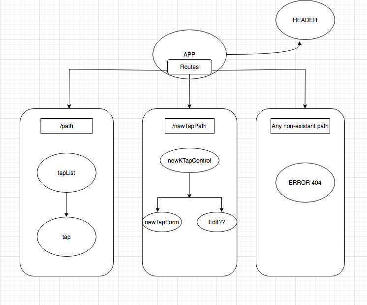

## By **George Acosta**

TAP DADDY APP MAP



## Setup/Installation Requirements


### Zip:

1. Click [here](https://github.com/eliza85/ascii_group_project.git) to go to the repository location where you will find the clone/download menu.


##### Mac OS Installation

 1. If any errors occur here, refer to the **Troubleshooting** section below these instructions.
**Ascii Land**.


- - -

## Specifications

- - -

## Technologies Used

 - React
 - Google Font Loader

- - -

## Troubleshooting

#### Can't install RMagick. Can't find libMagick or one of the dependent libraries. Check the mkmf.log file for more detailed information

Typically this message means that one or more of the libraries that ImageMagick
depends on hasn't been installed. Examine the mkmf.log file in the ext/RMagick
subdirectory of the installation directory for any error messages. These
messages typically contain enough additional information for you to be able to
diagnose the problem. Also see [this FAQ](https://web.archive.org/web/20131206133600/http://rmagick.rubyforge.org/install-faq.html#libmagick).


```sh

```
- - -

### Support and Contact

If you run into any issues running **TAP DADDY**, please contact **George Acosta**.

### License

Permission is hereby granted, free of charge, to any person obtaining a copy of this software and associated documentation files (the "Software"), to deal in the Software without restriction, including without limitation the rights to use, copy, modify, merge, publish, distribute, sublicense, and/or sell copies of the Software, and to permit persons to whom the Software is furnished to do so, subject to the following conditions:

The above copyright notice and this permission notice shall be included in all copies or substantial portions of the Software.

THE SOFTWARE IS PROVIDED "AS IS", WITHOUT WARRANTY OF ANY KIND, EXPRESS OR IMPLIED, INCLUDING BUT NOT LIMITED TO THE WARRANTIES OF MERCHANTABILITY, FITNESS FOR A PARTICULAR PURPOSE AND NON-INFRINGEMENT. IN NO EVENT SHALL THE AUTHORS OR COPYRIGHT HOLDERS BE LIABLE FOR ANY CLAIM, DAMAGES OR OTHER LIABILITY, WHETHER IN AN ACTION OF CONTRACT, TORT OR OTHERWISE, ARISING FROM, OUT OF OR IN CONNECTION WITH THE SOFTWARE OR THE USE OR OTHER DEALINGS IN THE SOFTWARE.

Copyright (c) 2020 ** George Acosta**

